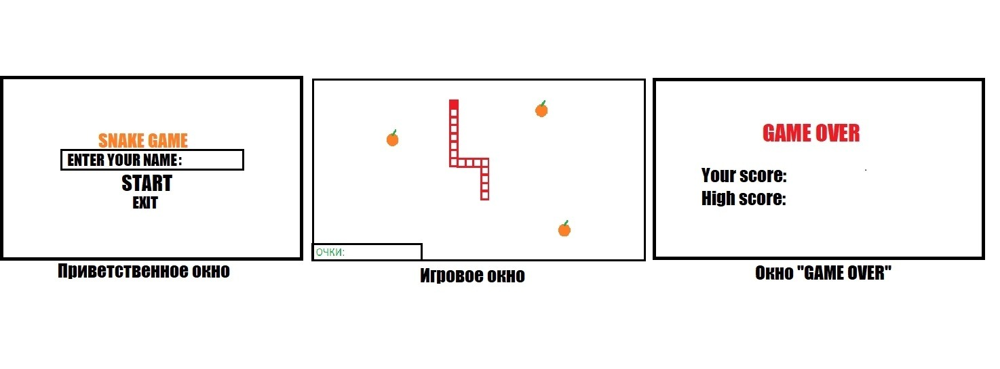
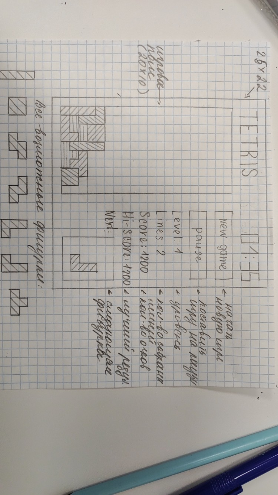

### PROJECTS:

Змейка:
   * Трусов - Турбанов
   * https://github.com/heatmeet/GameSnake
   * 
   

Воздушный шар:
   * Фадеева - Рекус
   * https://github.com/commonprojectwithus/AirBallon_game

Эволюция:
   * Бутин - Ткаченко

Tetris:   
   * Золотарев - Друк
   * https://github.com/ZolotarevAlexandr/tetris_pygame_project
   * .jpg)
   * 
      
Space-Invaders++:
   * Гребещенко - Хурдаян

???:
   * Бутов - Осипов
   
   
 1. Сделать репозиторий для проекта
 2. Макет игры (на бумаге, paint, figma, ps)
 3. Поискать графику и музыку для игры
